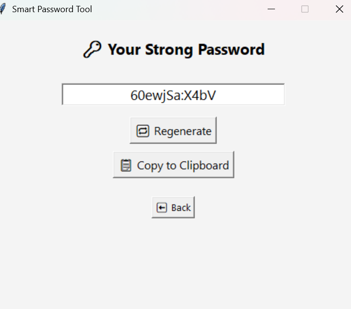

# 🔐 Smart Password Tool (Password Pro)

**Smart Password Tool (Password Pro)** is a user-friendly Python desktop application that helps users **generate secure passwords** and **check the strength** of their current ones. Built with `Tkinter`, the tool ensures users create strong credentials, helping prevent weak password practices.


---

## 📌 Features

- ✅ Generate strong, random passwords
- ✅ Check the strength of any entered password
- ✅ Get real-time feedback and improvement tips
- ✅ Regenerate and copy password to clipboard with one click
- ✅ Clean and modern graphical interface using Tkinter
- ✅ Offline and lightweight – no internet or dependencies required

---

## 🧠 How It Works

### 1. **Password Generation**
- Randomly creates passwords using uppercase, lowercase, digits, and special characters.
- Continues generating until the password meets "Strong" criteria.
- Users can regenerate or copy the password to clipboard instantly.

### 2. **Password Strength Checker**
- Analyzes password based on:
  - Length (8+ characters)
  - Use of both uppercase and lowercase letters
  - At least one number
  - At least one special character
- Returns results: `Weak`, `Moderate`, or `Strong`
- Offers personalized tips for improving weak passwords


---

## 🚀 How to Run

### 🧰 Prerequisites

- Python 3.6+
- Tkinter (comes pre-installed with Python)

### ▶️ Running the App

1. Clone the repository:
   ```bash
   git clone https://github.com/your-username/password-pro.git
   cd password-pro
   ```

2. Run the application:
   ```bash
   python PasswordChecker.py
   ```

---

## 🖼️ Screenshots

- **Home Screen:**  
  Easy navigation between password generation and strength check tools.

- **Check Password Strength:**  
  Enter any password and get instant feedback with improvement suggestions.

- **Generate Strong Password:**  
  Randomly creates a secure password, with the option to regenerate and copy.

 


---

## 📁 Project Structure

```
password-pro/
├── password_tool.py
├── README.md
├── <home-image>.png
├── <Checker-image>.png
└── <Generator-image>.png
```

---

## 💡 Future Improvements

- Add password visibility toggle
- Support saving passwords locally or to a password manager
- Include strength meter (progress bar UI)
- Option to customize password rules

---

## 🙏 Acknowledgments

Created as part of a cybersecurity mini-project to promote safe password practices and hands-on application of GUI programming.

---

## 📜 License

This project is open-source and available under the **MIT License**. Feel free to use and modify with attribution.
